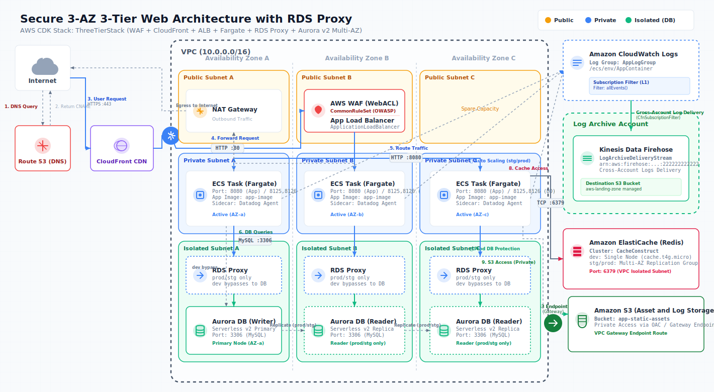
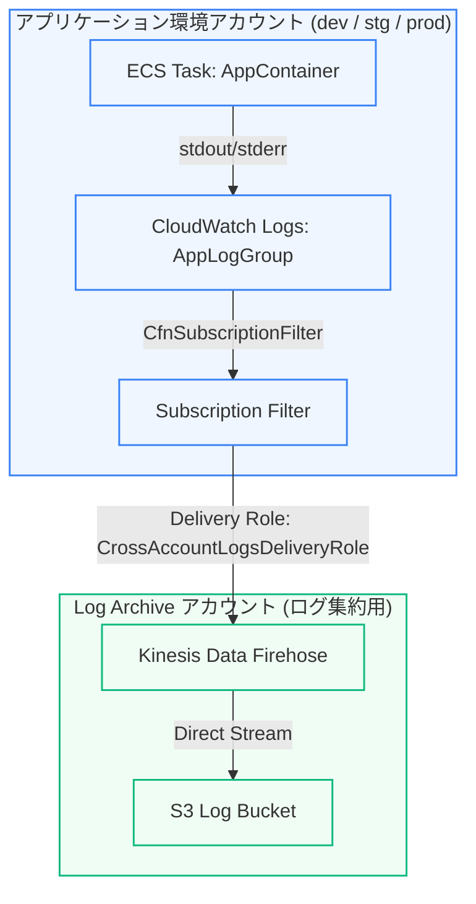

# learning-ts-concepts (AWS CDK 3-Tier Architecture Template & Frontend Demo)

このリポジトリは、TypeScript と AWS CDK を用いて、**セキュリティ**・**可観測性（Observability）**・**テスト自動化**・**CI/CD品質ゲート**を統合した、プロダクションレディな学習用三層アーキテクチャテンプレートです。

また、フロントエンドのポートフォリオ実演として、複数のゲームやツールを起動できる「インタラクティブ・アプリランチャー（ポータル）」と、そのデモゲーム（テトリス、AI対戦オセロ、タイピングゲーム）を同梱しています。

🌐 **[今すぐデモ画面を開く (GitHub Pages ポータル)](https://shadow-architect-dev.github.io/learning-ts-concepts/app/)**

---

## 🏗️ アーキテクチャ構成

- **DNS / CDN層**: Route 53 (DNS) + CloudFront (CDN)
- **セキュリティ層**: AWS WAFv2 (Web ACL) によるALB保護、カスタムヘッダーによる直接ALBアクセス拒否
- **ロードバランサー層**: Application Load Balancer (ALB)
- **Web / アプリケーション層**: ECS on Fargate (3 AZs)
- **可観測性 (Observability)**: **Datadog Agent (サイドカーパターン)** による APM トレース ＆ カスタムメトリクス収集
- **ログ集約 (Governance)**: **Kinesis Data Firehose** 経由での `Log Archive` アカウントへのクロスアカウントログ転送
- **データ層**: Amazon Aurora Serverless v2 (MySQL 互換)
- **データ転送最適化**: **S3 ゲートウェイ VPC エンドポイント**による無料の閉域網接続
- **マルチ環境対応**: `dev` / `stg` / `prod` の独立した 3 スタック構成
- **組織基盤（Landing Zone）統合**: **AWS VPC IPAM** による動的CIDRアロケーションおよび **Transit Gateway (TGW)** 経由の集約アウトバウンド（Common Egress）通信

### 🌐 AWS VPC IPAM ＆ Transit Gateway によるマルチアカウント閉域ネットワーク統合

本プロジェクトは、共通基盤（`aws-landing-zone`）とシームレスに閉域統合されるマルチアカウント・ネットワークトポロジーを想定して設計されています。

* **AWS VPC IPAM による動的IPアドレス管理**:
  手動での VPC CIDR ハードコードを排除し、`IpAddresses.awsIpamAllocation` を用いて、Landing Zoneから共有された IPAM プールから `/16` のCIDRブロックを動的に切り出してVPCを構築します。これにより、組織内の他のシステム（EKS側など）との間でのIPアドレス衝突を自動的に防ぎます。
* **Transit Gateway (TGW) 経由の集約アウトバウンド (Common Egress)**:
  自VPCのNAT Gatewayを廃止（`natGateways: 0`）し、代わりに共有された TGW への VPC アタッチメント（`CfnTransitGatewayAttachment`）を配置。プライベートサブネットからのデフォルトルート（`0.0.0.0/0`）を TGW に向ける（`CfnRoute`）ことで、すべての外部通信を Shared Services アカウントの集約 NAT GW へ中継させ、起動コストを極小化しています。

### 📊 アーキテクチャ図



> [!NOTE]
> **集約アウトバウンド（Common Egress）移行に伴う構成変更**:
> 上記の図には自VPC内の「NAT Gateway」が描かれていますが、インフラコスト最適化（FinOps）およびセキュリティ統制の一元化のため、現在はVPC内の自前 NAT Gateway は完全に撤廃されています。すべてのインターネット向け送信通信（`0.0.0.0/0`）は、**Transit Gateway (TGW)** を経由して共通基盤である `Shared Services` アカウントの集約 NAT Gateway から安全に送出される構成となっています（CDKコード上はすでに反映済みです）。

#### 📝 ログ配信フロー (Log Pipeline Diagram)



---

## 🛡️ プロダクションレディを担保するアーキテクチャ設計原則 ＆ SREプラクティス

### 1. セキュリティ ＆ ガードレール
*   **非Root（非特権）ユーザー実行 ＆ 読み取り専用ルートファイルシステムの徹底（コンテナセキュリティ）**: アプリケーション（Nginx）コンテナの実行ポートを非特権ポートの `8080` に変更し、非特権の `nginx` ユーザーで稼働。さらに、コンテナのルートファイルシステムを完全に読み取り専用（`readonlyRootFilesystem: true`）とし、Nginxの一時書き込み領域（`/tmp`）のみインメモリの一時ボリューム（`emptyDir` ボリューム）をマウントする構成にしています。これにより、コンテナ内での不正な設定変更やマルウェアの設置などのファイル改ざんリスクを物理的にシャットアウトする強固なランタイムセキュリティを確立しています。
*   **バージョンピン留めによる再現性担保**: Dockerベースイメージ（`nginx:1.25.4-alpine`）および Datadog Agent サイドカーイメージ（`gcr.io/datadoghq/agent:7.54.0`）のバージョンを厳密に固定。不意の自動アップデートによる起動失敗（SPOF）を回避します。
*   **オリジン保護**: CloudFront と ALB 間にカスタムヘッダー（`X-Origin-Verify`）による検証を導入。ALBパブリックDNSへの直接アクセスを ALB リスナーレベルで `403 Forbidden` としてシャットアウトし、アクセスを必ず CloudFront + WAF 経由に強制します。
*   **最小権限の原則**: GitHub Actions 用の IAM ロール（OIDC認証）は、対応する環境（`develop` ブランチは `dev` ロール、`main` ブランチは `prod` ロールのみを引き受け可能）へ厳密に分離し、過剰な権限付与を防いでいます。
*   **データベース ＆ キャッシュのアウトバウンド通信遮断（最小権限の適用）**: データベース（Aurora）およびキャッシュ（Redis）のセキュリティグループに対し、送信通信（Egress）を完全に遮断。AWS CDK の `allowAllOutbound: false` 設定と、すべての接続構成後に実行される明示的なダミー拒否Egressルールの登録により、CloudFormationレベルで自動付与されてしまう「全送信許可 (0.0.0.0/0)」ルールを確実に抑止するゼロトラスト構造を実装しています。

### 2. AWS KMS によるリソース暗号化ガバナンス
*   **カスタマー管理キー (CMK) の一元管理**: AWS管理のデフォルト共通鍵を排し、アクセス制御とキーライフサイクルを自社制御可能な KMS カスタマー管理キーを一元プロビジョニング。
*   **多層暗号化の徹底**: Aurora DB ストレージ、Secrets Manager シークレット、アプリケーションロググループ (`/ecs/env/AppContainer`)、および ECS Exec 監査用ロググループのすべてを同じ KMS キーで暗号化。
*   **環境別パラメータ制御**: セキュリティとコストの最適化パリティを維持するため、本番（`prod`）のみ **キー自動ローテーション (EnableKeyRotation)** を有効化し、削除ポリシーを `RETAIN`（他環境は `DESTROY`）に設定。

### 3. 静的アセットのオリジン分割配信 ＆ 厳密なバケット保護
*   **アセットオフロード**: 静的コンテンツ（CSS/JS/画像）を ECS Fargate の外に分離し、アセット専用のプライベート S3 バケットへオフロード。CloudFront にて動的 API リクエストと `/assets/*`（S3 Origin）のキャッシュルーティングを統合。
*   **Origin Access Control (OAC)**: S3 バケットのパブリックアクセスを完全ブロックした上で、CloudFront からの SSL 通信アクセスのみを OAC 経由で許可。
*   **環境パリティ制御**: `dev`/`stg` はスタック削除時に自動でオブジェクトを削除してバケットをクリーンアップする自動消去 Lambda リソースを自動アタッチ。`prod` はアセット損失を防止するため削除ポリシーを `RETAIN` に設定。

### 4. ElastiCache (Redis) の環境別トポロジー最適化
*   **キャッシュ層の構築**: アプリケーションの応答性能向上とデータベース負荷低減のため、Isolated サブネットに Redis キャッシュレイヤーをプロビジョニング。
*   **コスト ＆ 可用性のスペック作り分け**: 
  *   `dev` 環境：コスト極小化のため、レプリカなし・マルチAZ無効のシングルノード構成（`cache.t4g.micro`）。
  *   `stg`/`prod` 環境：高可用性確保のため、プライマリ1台＋レプリカ1台のマルチAZ構成・自動フェイルオーバー有効のレプリケーションクラスター構成（`cache.t4g.micro`）。

### 6. Secrets Manager 認証情報の自動ローテーション
*   **AWS 標準テンプレートの採用**: 資格情報の長期固定化リスクを排除するため、標準提供されている MySQL シングルユーザーローテーションテンプレート（`MYSQL_ROTATION_SINGLE_USER`）を使用した AWS Lambda による定期パスワード変更を実装。
*   **ローテーションの環境別スイッチ**: 自動更新 Lambda の常時起動コストや API 料金を避けるため、`stg`/`prod` のみ 30日周期での自動ローテーションを設定し、開発環境 (`dev`) では自動ローテーションをスキップ。

### 7. ECS Exec 安全デバッグ ＆ 監査ロギング
*   **本番環境での無効化強制**: 開発・ステージング環境 (`dev`/`stg`) はデバッグ効率化のため ECS Exec を `true` に設定し、本番環境 (`prod`) のみセキュリティ境界維持のため `enableExecuteCommand: false` を適用。
*   **操作セッションの完全監査ログ**: コンテナに対するリモートコマンドの操作ログを専用のロググループへオーバーライド転送。通信およびログ書き込みは KMS CMK によって強力に暗号化。

### 8. データ堅牢性の保護（変更管理・事故防止）
*   **本番DB削除保護と保持ポリシー**: 本番環境（`prod`）の Aurora Serverless v2 DBクラスターに対して、`deletionProtection: true` を明示的に設定。また、スタック削除時にもデータが安全に保護されるよう `removalPolicy` を `RETAIN` に設定しています（`dev`/`stg` 環境は開発効率のために `DESTROY` を許容）。

### 9. 可観測性 (Observability) - Datadog サイドカー
*   **サイドカーパターン**: 各 ECS タスク内に、アプリケーションコンテナ（`AppContainer`）と並行して **Datadog Agent** コンテナを同居させるサイドカー設計を採用。
*   **通信の局所化**: Fargate の `awsvpc` モードの特性を活かし、メインアプリと Datadog Agent 間の通信は `localhost` (Port: 8125/UDP for DogStatsD, 8126/TCP for APM) を通じて超低遅延で完結します。
*   **起動順序制御 (Container Dependency)**: APMやメトリクス収集の漏れを防ぐため、Datadog Agent が正常に起動（`START`）した後にアプリケーションコンテナが立ち上がる依存関係を CDK で定義しています。

### 10. セキュリティガバナンス ＆ クロスアカウントログ集約（Log Archive）
*   **安全なログ集約ライン**: アプリケーション（ECS Fargate）のコンテナログを、セキュリティ保護された別アカウント（`Log Archive`）の **Kinesis Data Firehose** へと直接リアルタイムにストリーミング配信します。
*   **CfnSubscriptionFilter (L1) によるバインド**: クロスアカウント境界における IAM Role/Kinesis ARN バインド時のバリデーション制約をクリアするため、L2 の `SubscriptionFilter` ではなく L1 の `CfnSubscriptionFilter` を採用。`shared-outputs.md` から読み取った動的な接続 ARN を直接バインドするセキュアな構造です。
*   **GitOps パラメータ連携**: 管理リポジトリ `aws-landing-zone` と本リポジトリ間で `shared-outputs.md` をインターフェースとして使用。アカウントIDや配信先ストリームの変更に追従する GitOps 連携を自動化しています。

### 11. 高可用性 ＆ 動的オートスケーリング
*   **ターゲット追跡スケーリング（Target Tracking）**: 本番（`prod`）およびステージング（`stg`）環境において、CPU使用率およびメモリ使用率（閾値: 70%）に基づく動的なオートスケーリングを設定。突発的なアクセススパイクに対応可能です。
*   **最小稼働台数のマルチAZ保護**: 本番環境（`prod`）では、常に最低 2 台以上のタスクが異なるAZ（アベイラビリティゾーン）に分散配置され、単一障害点（SPOF）を徹底して排除しています。
*   **開発コストの極小化とスケジュール制御**: 開発環境（`dev`）ではオートスケーリングを排し、毎日夜間自動停止（タスク数 0）と朝の自動起動を行うスケジュールスケーリングを適用。クラウド費用を節約します。

### 12. テスト自動化 (CDK Assertion Tests)
*   `aws-cdk-lib/assertions` と Jest を用いた**インフラ単体テスト**を実装。
*   AWSアカウントにデプロイすることなく、ローカルおよびCI上で「VPC、ALB、WAF、ECSクラスター・サービス、RDSクラスター、S3バケット、CloudFront OAC、KMSキー、Secrets Manager自動ローテーション」が仕様通りに構成されているかを瞬時に検証可能です。

### 13. CI/CD セキュリティゲート (GitHub Actions)
*   **Hadolint**: Dockerfile の静的解析を行い、コンテナビルドのベストプラクティスを強制。
*   **Trivy**: コンテナイメージの脆弱性スキャンを実行し、危険度の高い脆弱性（`HIGH`/`CRITICAL`）を自動検知してデプロイをブロック。
*   **OSパッケージの自動最新化**: Trivy で検出されたベースイメージ由来の既知の脆弱性を自動解消するため、`Dockerfile` ビルド時に `apk update && apk upgrade` を実行するセキュリティパッチ構造を実装。
*   **検証（Local/CI）モードの適用**: 現在はAWSのデプロイ費用を0円に抑えるため、実際のデプロイステップをバイパスし、Linter、Trivyスキャン、アサーションテスト、`cdk synth` による構文チェックのみを安全に実行するCI構成となっています。

---

## 💰 クラウドコスト見積もり ＆ FinOps 最適化 (Cost Estimation)

本アーキテクチャを AWS 上に構築した際の、アイドル状態（リクエストほぼゼロ）における月額の基本料金の見積もりです。
※ 1ドル＝155円換算で算出しています。

### 環境別の月額コスト概算
*   **開発環境 (dev)**: **約 $103 / 月 (約 16,000 円)**
*   **検証環境 (stg)**: **約 $264 / 月 (約 41,000 円)**
*   **本番環境 (prod)**: **約 $468 / 月 (約 73,000 円)**

### 💡 dev 環境におけるコスト削減の取り組み（FinOps）
開発環境 (`dev`) では、検証・本番環境と同等のネットワークトポロジーを維持しつつ、以下の施策によって**本来約 4 万円/月かかるコストを約 1.6 万円/月（約 60% 削減）**まで抑え込んでいます。
*   **夜間自動停止の適用**: EventBridge と Lambda を用い、夜間（20:00〜翌朝8:00）に ECS および Aurora Serverless v2 を自動停止させ、稼働時間を約 50% に削減。
*   **NAT Gateway の完全排除（集約アウトバウンド移行）**: 開発環境 (`dev`) の VPC から自前 NAT Gateway を撤廃し、VPCエンドポイントを活用しつつ、外部通信は Transit Gateway 経由で Landing Zone の集約 NAT GW へ流すことで基本料金を完全に削減。
*   **トポロジーのダウングレード**: Redis キャッシュをマルチAZクラスターからシングルノードに変更し、DB Proxy を非搭載にすることで不要なライセンス/稼働費用をカット。

### 📈 さらなるコスト削減の余地 (Savings Plans ＆ Reserved Instances)
本見積もりはすべて標準の **オンデマンド料金** で算出しています。本番環境（`prod`）等で長期（1年以上）の継続稼働が確定している場合は、以下の割引プランを適用することで、さらにコストを削減できます。
*   **Compute Savings Plans の適用 (ECS Fargate)**: コミットメント契約により、Fargate のコンピューティング料金を **約 20% 〜 35% 削減** 可能。
*   **Reserved DB Instances の適用 (Aurora / ElastiCache)**: インスタンスキャパシティの事前予約により、データベースおよびキャッシュのインスタンス料金を **約 30% 〜 45% 削減** 可能。

---

## 📂 主要ディレクトリ構成

- `infra/` - CDK アプリケーション（AWSインフラ定義）
  - `bin/main.ts` - スタック生成エントリ（dev/stg/prod）
  - `lib/constructs/network.ts` - VPC / セキュリティグループ定義
  - `lib/constructs/compute.ts` - ECS Fargate ＆ **Datadog Agent サイドカー**定義
  - `lib/constructs/database.ts` - Aurora Serverless v2 定義
  - `lib/stack.ts` - 3層アーキテクチャ統合スタック
  - `test/stack.test.ts` - **CDKアサーションテストコード**
- `monitoring/` - CDKTF アプリケーション（Datadog監視定義）
  - `main.ts` - CDKTFスタック生成エントリ
  - `lib/config/config.ts` - 環境設定抽象化ヘルパー
  - `lib/datadog-stack.ts` - Datadogスタック定義（S3/DynamoDBリモートステート対応）
  - `lib/monitors/` - 各AWSリソース（ECS/RDS）のDatadogモニター（アラート）および **SLO（サービスレベル目標）定義**
- `diagrams/` - 構成図（Architecture Diagram）の格納
  - `architecture_v7.svg` - **アーキテクチャ図**
- `docs/` - 運用ドキュメント・ウォークスルーの格納
  - `walkthrough.md` - **設計・実装履歴ウォークスルー**
  - `sre/` - **SRE 信頼性基準 ＆ SLO/SLI 設計定義**
    - [slo-sli.md](file:///c:/Git/learning-ts-concepts/docs/sre/slo-sli.md) - SLO/SLI 策定定義書テンプレート
    - [template.md](file:///c:/Git/learning-ts-concepts/docs/sre/reports/template.md) - **SLO/SLI 月次運用報告書テンプレート**
    - [post-mortem-sample.md](file:///c:/Git/learning-ts-concepts/docs/sre/post-mortems/post-mortem-sample.md) - **障害振り返り報告書 (Blameless Post-Mortem) サンプル**
    - [disaster-recovery-policy.md](file:///c:/Git/learning-ts-concepts/docs/sre/disaster-recovery-policy.md) - **災害復旧 (DR) 方針書**
    - [load-testing-plan.md](file:///c:/Git/learning-ts-concepts/docs/sre/load-testing-plan.md) - **負荷テスト ＆ キャパシティプランニング計画書**
    - [chaos-engineering.md](file:///c:/Git/learning-ts-concepts/docs/sre/chaos-engineering.md) - **カオスエンジニアリング実験計画書**
  - `runbook/` - **障害対応・トラブルシューティング手順書 (Runbook)**
    - [troubleshooting-availability.md](file:///c:/Git/learning-ts-concepts/docs/runbook/troubleshooting-availability.md) - API可用性低下時の一次対応手順
    - [troubleshooting-latency.md](file:///c:/Git/learning-ts-concepts/docs/runbook/troubleshooting-latency.md) - API遅延発生時の一次対応手順
    - [troubleshooting-cloudfront.md](file:///c:/Git/learning-ts-concepts/docs/runbook/troubleshooting-cloudfront.md) - 静的アセット配信エラー時の一次対応手順
    - [troubleshooting-disaster-recovery.md](file:///c:/Git/learning-ts-concepts/docs/runbook/troubleshooting-disaster-recovery.md) - **大規模災害（東京リージョン全滅）時の大阪復旧手順**
    - [application-deployment.md](file:///c:/Git/learning-ts-concepts/docs/runbook/application-deployment.md) - **アプリケーションデプロイ手順書（★エンジニア向け）**
    - [maintenance-mode.md](file:///c:/Git/learning-ts-concepts/docs/runbook/maintenance-mode.md) - **メンテナンスモード切り替え手順書（★SRE・運用向け）**
    - [slo-reporting-guide.md](file:///c:/Git/learning-ts-concepts/docs/runbook/slo-reporting-guide.md) - **SLO/SLI 運用および報告手順書（★SRE向け）**
  - `governance/` - **マルチアカウント ＆ エンタープライズガバナンス設計方針書**
    - [multi-account-design.md](file:///c:/Git/learning-ts-concepts/docs/governance/multi-account-design.md) - マルチアカウント設計方針
    - [security-and-audit.md](file:///c:/Git/learning-ts-concepts/docs/governance/security-and-audit.md) - 監査・セキュリティ基準
    - [cost-management.md](file:///c:/Git/learning-ts-concepts/docs/governance/cost-management.md) - コスト管理・財務ガバナンス方針
    - [shared-outputs.md](file:///c:/Git/learning-ts-concepts/docs/governance/shared-outputs.md) - **リポジトリ間連携用インターフェース仕様書（★AI連携用）**
- `app/` - アプリケーションコード
  - `Dockerfile` - Nginxコンテナ定義（**セキュリティ自動パッチ機能付き**）
  - `index.html` - 静的デモ画面

---

## 🛠️ ローカルでの開発・検証手順

### 1. 依存関係のインストール
```powershell
cd infra
npm ci
```

### 2. インフラの単体テスト実行 (CDK Assertions & Jest)
```powershell
npm test
```

### 3. CloudFormation テンプレート of 合成 (synth) の動作チェック
```powershell
# 開発環境 (dev) のシンセサイズ確認
npx cdk synth ThreeTierStack-dev -c imageTag=local-test -c natGateways=0
```

---

## 📊 Datadog 監視（CDK for Terraform）の導入 ＆ セットアップ

AWSインフラ（ECS, RDS）のアラート（Monitor）を TypeScript から宣言的に管理するため、**CDK for Terraform (CDKTF)** を導入しました。
状態管理（State）は Amazon S3 および DynamoDB を用いたリモートバックエンドに対応しており、ローカル実行時は自動的にローカルステートにフォールバックするハイブリッド設計となっています。

### 🔑 ユーザー側で必要なアクション（GitHub Secrets の設定）

CDKTF による Datadog への自動デプロイ（GitHub Actions）を動作させるために、GitHub リポジトリの **Settings > Secrets and variables > Actions** に以下の Secrets を必ず登録してください。

| Secret 名 | 説明 |
| :--- | :--- |
| `DATADOG_API_KEY` | Datadog の API キー（アカウントの監視権限） |
| `DATADOG_APP_KEY` | Datadog の Application キー（モニター等リソース操作用） |
| `TERRAFORM_STATE_BUCKET` | `.tfstate` 状態ファイルを保存する AWS S3 バケット名 |
| `TERRAFORM_LOCK_TABLE` | 同時実行衝突を防ぐための AWS DynamoDB ロックテーブル名 |
| `AWS_ACCESS_KEY_ID` | 上記 S3/DynamoDB を操作可能な IAM ユーザーのアクセスキー |
| `AWS_SECRET_ACCESS_KEY` | 上記 IAM ユーザー of シークレットアクセスキー |

### 🛠️ ローカルでの CDKTF 開発・検証手順

`cdktf-datadog` ディレクトリ内で動作確認を行います。

```powershell
cd monitoring
# 1. 依存関係のインストール（Windowsでのnode-ptyビルドエラーを避けるため ignore-scripts を指定）
npm install --ignore-scripts

# 2. TypeScript コンパイル確認
npm run compile

# 3. CloudFormation 相当の Terraform JSON の合成 (synth)
# (ローカル検証用に適当なダミー値を設定)
$env:TERRAFORM_STATE_BUCKET="dummy"; $env:TERRAFORM_LOCK_TABLE="dummy"; npx cdktf synth
```

---

## 🚀 将来の実際のAWSデプロイへのロードマップ

実際に AWS 環境への自動デプロイを再開したい場合は、以下の手順を実施します。

1.  **AWS OIDC ロールの初回デプロイ**:
    ローカル環境からAWS CLIに認証した上で、手動で以下のCDKデプロイを実行し、各環境に必要なデプロイ用IAMロールおよびECRリポジトリを作成します。
    ```powershell
    npx cdk deploy ThreeTierStack-dev --require-approval never
    ```
2.  **GitHub Secrets の設定**:
    GitHub リポジトリの **Settings > Secrets and variables > Actions** にて、作成された IAM ロール ARN を `ROLE_ARN_DEV` / `ROLE_ARN_STG` / `ROLE_ARN_PROD` として登録します。
3.  **GitHub Actions のデプロイステップ復元**:
    [.github/workflows/deploy.yml](.github/workflows/deploy.yml) 内の、コメントアウトまたは削除された `Configure AWS credentials via OIDC` ステップ、ECRへのログイン・プッシュ、および `npx cdk deploy` コマンドを有効化します。
