# コスト管理・財務ガバナンス方針（Cost Management & Cloud FinOps）

本ドキュメントでは、マルチアカウント環境におけるインフラコストの可視化、削減、および予算アラートを制御するための財務ガバナンス（FinOps）設計方針を定義します。

---

## 1. 一括請求（Consolidated Billing）と割引最適化

AWS Organizations の機能である **Consolidated Billing（一括請求）** を活用し、組織全体のコストを最適化します。

### ボリュームディスカウントの最大化
- 組織内のすべてのアカウントにおけるデータ転送量や各種リソース（S3など）の利用枠が合算されるため、単一アカウント契約よりも高いボリュームディスカウントが自動的に適用されます。

### 割引パッケージ（Savings Plans / RIs）の集中管理
- **Compute Savings Plans / EC2 Instance Savings Plans** および **Reserved Instances (RIs)** は、個別のアカウントごとに購入するのではなく、**Management（管理）アカウント** で一括購入し、組織全体のメンバーアカウントへ適用させます。
- **共有ポリシー**: 特定のアカウントで余剰となった割引枠は、他のアクティブなアカウント（`stg` や `prod` など）に自動適用（Sharing）されるよう設定します。これにより、無駄な割引の失効（コミットメントのミスマッチ）を防ぎます。

---

## 2. 環境別のコスト最適化ポリシー

開発コストを削減しつつ、本番環境のサービス品質を両立するための設計基準です。

```mermaid
gantt
    title 開発環境（dev）のコストライフサイクル (JST基準)
    dateFormat  HH:mm
    axisFormat %H:%M
    section 業務時間内 (アクティブ)
    ECS 1台 & Aurora 稼働  :active, 08:00, 20:00
    section 夜間・休日 (一時停止)
    ECS 1台 & Aurora 一時停止 :crit, 20:00, 08:00
```

### 1. 開発環境（`dev`）におけるコストの最小化
- **リソースの自動停止**: 開発（`dev`）および検証（`stg`）環境の Aurora Serverless v2 クラスターは、共通の Resource Scheduler（タグ `Schedule = office-hours` 連携）を用いて夜間・休日（JST 20:00 〜 翌 08:00）に自動停止され、非アクティブ時間のデータベース利用料金を削減します。
- **Nat Gateway の削減**: `dev` 環境における外部通信は、Nat Gateway（固定費約 $32/月）を配置せず、パブリックIPの動的アタッチ等でコストをバイパス可能なオプションを用意します（CDKコンテキストパラメータ `natGateways=0` で制御可能）。

### 2. ステージング環境（`stg`）における適正サイズ化 (Rightsizing)
- 本番と同等構成（Proxy / リードレプリカあり）にする一方、Aurora Serverless v2 の最小・最大容量（ACUs）や、Fargate のタスク CPU/Memory スペックは、本番の 50% 程度にサイズダウンして運用します。

### 3. 本番環境（`prod`）におけるスケール制御
- ピークトラフィック時の過剰なスケーリングによるコストスパイクを防ぐため、Fargate のオートスケーリング上限値（Max Capacity）および Aurora の最大 ACUs（Max capacity）に厳密な上限キャップを設定します。

### 4. データ転送コストの最適化（全環境共通）
- **S3ゲートウェイエンドポイントの導入**: Amazon S3 へのアクセスにおいて、VPCエンドポイント（ゲートウェイ型）を経由させます。これは完全無料で利用できるため、高額な NAT Gateway のデータ処理料金（$0.062 / GB）を完全に回避でき、大幅なコスト削減とネットワーク遅延の低減を実現します。

---

## 3. コスト監査とアラート設計

不適切なリソースの放置や、開発者の誤操作による高額リソースの立ち上げを即座に検知するライフサイクルガードレールを構築します。

- **AWS Budgets (予算アラート)**:
  - アカウントおよび OU ごとに月額予算（例: `dev` アカウントは $200/月）を設定。
  - 予測される請求額、または実請求額が予算の `80%` および `100%` に達した段階で、Slack およびプラットフォーム管理者のメールに即座に通知。
- **AWS Cost Anomaly Detection (コスト異常検出)**:
  - 機械学習を用いて日常の利用パターンを分析。通常パターンから外れた急激なコストスパイク（例: 前日比 +$50 以上の急増）を検知した場合、原因リソース（インスタンスのサイズ間違いなど）を特定して即座にシステム管理者に警告を送信。
- **タグの強制ルール (AWS Config)**:
  - すべての IaC リソースにおいて、`Environment` (dev/stg/prod) および `Project` タグの付与を必須とします。
  - 未タグ化のリソースが存在する場合、AWS Config によって非準拠と判定し、コストカテゴリ（Cost Allocation Tags）による集計漏れを防ぎます。
