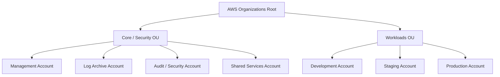
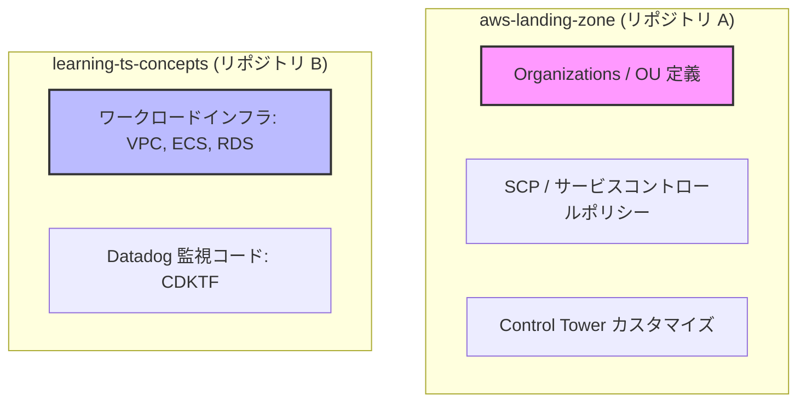

# マルチアカウント設計方針（Multi-Account Architecture Design）

本ドキュメントでは、エンタープライズ規模の運用においてセキュリティ、運用の独立性、および影響範囲（Blast Radius）の極小化を実現するための AWS マルチアカウント設計方針を定義します。

---

## 1. 全体アーキテクチャ ＆ 組織構成（AWS Organizations）

本番運用においては、**AWS Organizations** および **AWS Control Tower** を用いて、独立した複数の AWS アカウントを一元管理する「ランディングゾーン」を構築します。

### アカウント別役割定義

| アカウント名 | 役割 / 管理対象リソース | アクセス権限 |
| :--- | :--- | :--- |
| **Management** (管理) | 組織全体の統制、一括請求（Consolidated Billing）、アカウント払い出しのみ。 ※ ワークロードやCI/CDリソースの配置は厳禁。 | プラットフォーム統括者のみ（日常はアクセス制限） |
| **Log Archive** (ログ集約) | 組織内の全アカウントから集約される CloudTrail, Config, VPC Flow Logs, ECS コンテナログ等の保管庫（S3）。 ※ 削除・改ざん不可能なバケットポリシー（WORM）を設定。 | 監査人・ログ分析システムのみ（書き込みはクロスアカウント許可） |
| **Audit / Security** (監査・セキュリティ) | AWS GuardDuty, Security Hub, IAM Access Analyzer などの委任管理者（Delegated Administrator）。 組織全体の脅威検知・コンプライアンス監視のハブ。 | セキュリティチームのみ |
| **Shared Services** (共有サービス) | CI/CDセルフホストランナー（GitHub Actions Runner等）、プライベートコンテナレジストリ（ECR）、社内共通ツール。 | 開発チーム・インフラチーム |
| **Development** (開発環境) | 開発者が自由にサンドボックスとして利用する環境。コスト制御（夜間停止など）を重視。 | 開発者全員（パワーユーザー権限） |
| **Staging** (検証環境) | 本番と同等構成の検証環境。本番へのデプロイ前の動作確認、負荷テストを行う。 | インフラチーム ＆ リリース担当者 |
| **Production** (本番環境) | エンドユーザーがアクセスする本番稼働環境。セキュリティと可用性を最優先。 | 原則直接アクセス禁止（CI/CDパイプライン経由のみ） |

---

## 2. アカウント分離境界とネットワーク設計

アカウント間は物理的に独立した VPC となり、原則として通信は完全に遮断されます。

- **非接続の原則**: `dev`, `stg`, `prod` の VPC 相互間は、いかなる場合も直接ピアリング（VPC Peering）を行いません。
- **データ移行**: 環境間でデータを移行する必要がある場合は、直接ネットワーク接続せず、`Log Archive` アカウント等のセキュアな中間バケットを経由したオブジェクトコピー、または暗号化されたスナップショットの共有のみを許可します。
- **共有サービスへの接続**: 共通レジストリ等へアクセスする際は、AWS Transit Gateway または VPC Endpoint (PrivateLink) を用いて、必要な経路のみを最小限で接続します。

---

## 3. コード管理（GitOps / リポジトリ分離）

マルチアカウント構成のセキュリティを維持するため、IaC (CDK/Terraform) コードを管理するリポジトリを明確に分離します。

### リポジトリを分ける設計意図
1. **最小権限の原則 (Principle of Least Privilege)**:
   アプリケーション開発者が誤って組織全体に影響を及ぼすガードレール設定（SCPなど）を改変できないよう、リポジトリレベルで書き込み権限（GitHubのブランチ保護やCODEOWNERS）を分離します。
2. **デプロイ特権の分離 (Privileged Role Separation)**:
   管理アカウントを操作する極めて強力な IAM ロールを、日常の開発用リポジトリの GitHub Actions にバインドしないことで、サードパーティ製アクションの侵害やサプライチェーン攻撃からのリスクを極限まで低減します。
