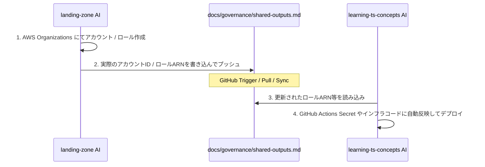

# 共有出力定義書（Shared Outputs Specification）

> [!IMPORTANT]
> **【管理アカウント側（`aws-landing-zone`）の AI アシスタントへの指示】**
> AWS Organizations や Control Tower を用いて各環境のアカウントを払い出し、デプロイ用 IAM ロールや S3 バケットを作成したら、**このドキュメントの「`【未設定】`」部分を実際に出力された AWS のリソース値（ARN や ID）で書き換えてコミット・プッシュしてください。**

---

## 1. 環境別共有パラメータ一覧

各ターゲット環境のデプロイおよび監視定義の適用に必要な AWS リソースの接続情報です。

### 1. 開発環境 (Development)
| パラメータ名 | 設定値 | 利用先（本リポジトリ） |
| :--- | :--- | :--- |
| **AWS Account ID** | `【未設定】` (例: `123456789012`) | OIDC ロール信頼ポリシーの検証 |
| **OIDC Deploy Role ARN** | `【未設定】` (例: `arn:aws:iam::123:role/github-deploy-dev`) | `.github/workflows/deploy.yml` (ROLE_ARN_DEV) |
| **ECR Repository URI** | `【未設定】` (例: `123.dkr.ecr.ap-northeast-1.amazonaws.com/app-repo-dev`) | `.github/workflows/deploy.yml` (ECR_REPO) |
| **CDKTF S3 Bucket** | `【未設定】` (例: `dd-state-bucket-dev`) | `.github/workflows/datadog.yml` (TERRAFORM_STATE_BUCKET) |
| **CDKTF DynamoDB Table**| `【未設定】` (例: `dd-lock-table-dev`) | `.github/workflows/datadog.yml` (TERRAFORM_LOCK_TABLE) |

### 2. 検証環境 (Staging)
| パラメータ名 | 設定値 | 利用先（本リポジトリ） |
| :--- | :--- | :--- |
| **AWS Account ID** | `【未設定】` | OIDC ロール信頼ポリシーの検証 |
| **OIDC Deploy Role ARN** | `【未設定】` | `.github/workflows/deploy.yml` (ROLE_ARN_STG) |
| **ECR Repository URI** | `【未設定】` | `.github/workflows/deploy.yml` (ECR_REPO) |
| **CDKTF S3 Bucket** | `【未設定】` | `.github/workflows/datadog.yml` (TERRAFORM_STATE_BUCKET) |
| **CDKTF DynamoDB Table**| `【未設定】` | `.github/workflows/datadog.yml` (TERRAFORM_LOCK_TABLE) |

### 3. 本番環境 (Production)
| パラメータ名 | 設定値 | 利用先（本リポジトリ） |
| :--- | :--- | :--- |
| **AWS Account ID** | `【未設定】` | OIDC ロール信頼ポリシーの検証 |
| **OIDC Deploy Role ARN** | `【未設定】` | `.github/workflows/deploy.yml` (ROLE_ARN_PROD) |
| **ECR Repository URI** | `【未設定】` | `.github/workflows/deploy.yml` (ECR_REPO) |
| **CDKTF S3 Bucket** | `【未設定】` | `.github/workflows/datadog.yml` (TERRAFORM_STATE_BUCKET) |
| **CDKTF DynamoDB Table**| `【未設定】` | `.github/workflows/datadog.yml` (TERRAFORM_LOCK_TABLE) |

---

## 2. 共有パラメータの反映フロー (GitOps)

1. **`aws-landing-zone` 側のインフラ構築**:
   プラットフォーム管理者が `Management` アカウント上でアカウントプロビジョニングを実行し、OIDC の引き受け用ロール等を作成します。
2. **本ファイルへの書き込み**:
   作成完了後、Organizations 側の AI または管理者が、本ファイルの `【未設定】` 箇所を埋めてプッシュします。
3. **`learning-ts-concepts` 側のデプロイ**:
   本リポジトリの AI （または開発者）は、このドキュメントの変更を検知（あるいは `git pull` して読み込み）、値に基づいてデプロイメント定義を同期し、CDK / CDKTF を実行して安全に個別アカウントへデプロイを完了させます。
